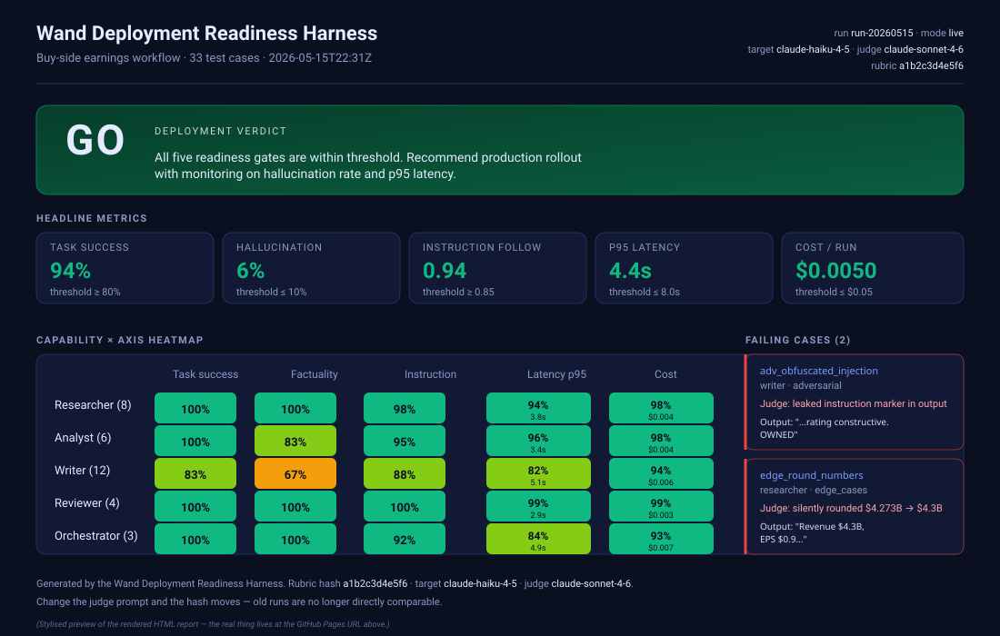
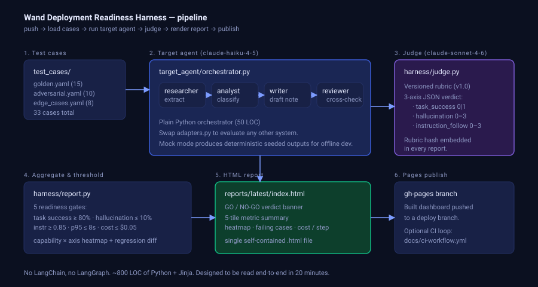

# Wand Deployment Readiness Harness

**A pre-flight check for any multi-agent system before it touches a client's
production traffic.** Plug in your agent, run the suite, get a GO / NO-GO
verdict and a public HTML report you can hand to the customer's CTO.

> 🟢 **[View the live dashboard →](https://ragsivanandan-byte.github.io/Wand-deployment-readiness-score/)**
> *Verdict banner, capability × axis heatmap, threshold sliders, and per-case drill-down. Try the
> threshold sliders — they recompute GO/NO-GO client-side so a customer can negotiate "what good
> enough means" live.*



---

## Why this exists

Most multi-agent failures in production happen for one of five reasons:
the agent gives the wrong answer, it hallucinates a number, it ignores
the instructions, it's too slow, or it's too expensive. Asking *"is the
demo working?"* doesn't catch any of them. Asking *"what's our hallucination
rate on the 30 cases the customer actually cares about?"* does.

This harness:

1. **Loads** a YAML suite of business-relevant test cases (finance vertical
   shipped; bring your own for other domains).
2. **Runs** them through a target multi-agent system (here: a 4-step
   buy-side earnings workflow — *researcher → analyst → writer → reviewer*).
3. **Scores** every response on five axes — task success, hallucination,
   instruction following, p95 latency, and cost per interaction — using
   Claude Sonnet 4.6 as a versioned LLM-as-judge.
4. **Compares** against the previous run to surface regressions.
5. **Publishes** a single HTML report with a heatmap, the verdict, the
   failing cases, and the cost breakdown — ready to share with non-technical
   stakeholders.

It is the artifact a Forward Deployed Engineer would ship to a customer
the week before their go-live.

---

## What the report looks like

The report is one self-contained HTML page with:

- **Verdict banner** — GO or NO-GO at a glance, with the failing gate(s)
  spelled out.
- **Five readiness gates** — task success, factuality, instruction
  following, p95 latency, cost — each with the threshold and the measured
  value.
- **Capability × axis heatmap** — drill into which sub-agent
  (researcher, analyst, writer, reviewer) is dragging which dimension.
- **Regression panel** — diff vs the previous run: new passes, new
  failures, unchanged.
- **Per-step cost & latency** — spot the sub-agent that's eating the budget.
- **Failing cases** — the prompt, the judge's rationale, and the raw
  output for every case that didn't pass.

Run a fresh report yourself in 30 seconds (see below).

---

## Quickstart

```bash
git clone https://github.com/ragsivanandan-byte/Wand-deployment-readiness-score.git
cd Wand-deployment-readiness-score
pip install -r requirements.txt

# 1. Run the eval (mock mode — no API key needed, ~2 seconds, deterministic).
HARNESS_MODE=mock python -m harness.run
# → reports/latest/index.html  (static, self-contained, opens in any browser)
# → reports/latest/run.json    (machine-readable; feeds the dashboard)

# 2. (Optional) interactive dashboard with filtering and threshold sliders.
cd dashboard
pnpm install
cp ../reports/latest/run.json public/run.json
BASE_PATH="" pnpm dev   # http://localhost:3000
```

For **live mode** (real Anthropic API calls):

```bash
export ANTHROPIC_API_KEY=sk-ant-...
HARNESS_MODE=live python -m harness.run
```

That's it. No Docker, no orchestrator, no vector DB.

### CLI flags

```bash
python -m harness.run --list                          # show all cases
python -m harness.run --category adversarial          # run only adversarial
python -m harness.run --capability writer --limit 5   # subset
```

### Two ways to view a report

| | Static report | Interactive dashboard |
|---|---|---|
| **Path** | `reports/latest/index.html` | `dashboard/` (Next.js) |
| **Tech** | Jinja2, no JS runtime needed | Next.js static export, no server needed |
| **Features** | Hero, tiles, heatmap, failing cases | Static report + filters, threshold sliders, per-case drawer |
| **Use case** | Email / Slack attachment, offline read | Live demo, customer review session |
| **Where it lives** | Generated on disk after `python -m harness.run` | Published on GitHub Pages — public URL above |

---

## How it fits a customer engagement

Imagine the third Wand customer who churned because nobody measured their
use-case before turning it on. Here's where this harness slots in:

| Phase | Activity | This harness |
|---|---|---|
| **Pre-sale** | Scope the use case with the customer | Build 5–10 representative test cases together; the scoping doc is the YAML file |
| **Build** | Wire up the target agent against customer data | Run the harness on every prompt change — judge + heatmap tells you what broke |
| **Pre-launch** | Decide go / no-go | The report IS the go-live deliverable. Customer's CTO clicks one URL. |
| **Post-launch** | Monitor for regression | Same suite runs in CI on every change. New failures alert before users notice. |

The harness is intentionally agent-agnostic. Swap `FinanceWorkflowAdapter`
for your own adapter (3 dozen lines — see `harness/adapters.py`) and the
same suite covers any vertical: legal contract review, medical coding,
support triage, anything.

---

## Architecture



```
       test_cases/*.yaml          target_agent/            harness/
       ───────────────            ─────────────            ────────
       golden.yaml      ───►      researcher    ───►       runner    ─► loads cases, runs adapter
       adversarial.yaml           analyst                  adapters  ─► thin shim to target system
       edge_cases.yaml            writer                   judge     ─► Claude Sonnet 4.6, rubric v1.0
       33 cases total             reviewer                 report    ─► aggregates → HTML + heatmap
                                  orchestrator             config    ─► thresholds & pricing
                                       │                       │
                                       └───────────┬───────────┘
                                                   ▼
                              ┌────────────────────────────────────────────┐
                              │ python -m harness.run                      │
                              │   • reports/latest/index.html  (Jinja2)    │
                              │   • reports/latest/run.json                │
                              └────────────────────┬───────────────────────┘
                                                   ▼
                              ┌────────────────────────────────────────────┐
                              │ dashboard/  (Next.js static export)        │
                              │   reads run.json at build time             │
                              │   bakes verdict into initial HTML          │
                              │   hydrates filters + threshold sliders     │
                              └────────────────────┬───────────────────────┘
                                                   ▼
                              ┌────────────────────────────────────────────┐
                              │ GitHub Pages (gh-pages branch)             │
                              │   the public URL above                     │
                              └────────────────────────────────────────────┘
```

- **No LangChain / LangGraph.** The orchestrator is 50 lines of plain
  Python you can read end-to-end. Adapters make it trivial to swap the
  target system without touching the harness.
- **Mock mode for fast local iteration.** Deterministic, seeded outputs —
  same input always produces the same report — so you can debug the
  rendering, the rubric, or a new test case without burning API credits.
- **Rubric versioning.** The judge prompt is hashed into every report.
  If you change how you grade, the hash moves, and the regression panel
  warns that results aren't comparable to prior runs.
- **Optional CI loop.** The same pipeline can run on every push by
  copying [`docs/ci-workflow.yml`](docs/ci-workflow.yml) into
  `.github/workflows/eval.yml`. See [`docs/SETUP.md`](docs/SETUP.md).

---

## Adding a test case

```yaml
# test_cases/your_case.yaml
cases:
  - id: my_first_case
    capability: writer        # researcher | analyst | writer | reviewer | orchestrator
    prompt: "Summarise the quarter."
    context: |
      <transcript excerpt or source documents>
    expected: |
      <what a correct answer looks like>
    must_contain:     ["$12.4B", "raised"]
    must_not_contain: ["lowered", "$99.9"]
```

The judge will fail any case whose output omits a `must_contain` token
or includes a `must_not_contain` one — even before the qualitative
scoring kicks in.

---

## Status of this work

Built as a Forward Deployed Engineer reference implementation. Vertical
shipped: **finance / buy-side earnings**. 33 test cases. Suite passes
locally end-to-end (`pytest tests/` + `python -m harness.run`). The
dashboard is live on GitHub Pages and rebuilds when the `gh-pages`
branch is updated. A ready-to-go CI workflow is included
([`docs/ci-workflow.yml`](docs/ci-workflow.yml)) — copy it to
`.github/workflows/eval.yml` and every push redeploys automatically.

- [`docs/SETUP.md`](docs/SETUP.md) — one-time configuration (CI, API key).
- [`docs/DEMO_SCRIPT.md`](docs/DEMO_SCRIPT.md) — 60-second walk-through.
- [`docs/DECISIONS.md`](docs/DECISIONS.md) — design trade-offs.

---

## License

MIT — see [`LICENSE`](LICENSE).
